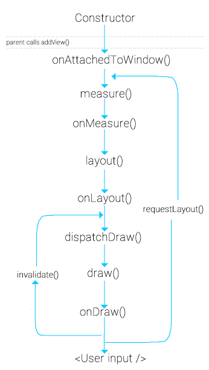

# Android Interview Questions

## Contents
* [Basic Android](#basic-android)
* [Core Android](#core-android)
* [Android Libraries](#android-libraries)
* [Android Architecture](#android-architecture)
* [Android Design Problem](#android-design-problem)
* [Android Unit Testing](#android-unit-testing)
* [Android Tools And Technologies](#android-tools-and-technologies)
* [Java and Kotlin](#java-and-kotlin)
* [Data Structures And Algorithms](#data-structures-and-algorithms)
* [Other Topics](#other-topics)

### Basic Android

* **What is Android.?** [Answer](https://github.com/Manohar2710/android-cheat-sheet/blob/master/Basic%20Android/What_is_Android.md)
	

* **Who is founder of Android.?**

	- Andy Rubins.

* **What are app components in Android?** [Answer](https://github.com/Manohar2710/android-cheat-sheet/blob/master/Basic%20Android/app_components.md)

* **What is the difference between Activity and AppCompatActivity?** [Answer](https://github.com/Manohar2710/android-cheat-sheet/blob/master/Basic%20Android/difference_between_Activity_and_AppCompatActivity.md)  

* **Activity, AppCompatActivity, FragmentActivity and ActionBarActivity. How are they related?** [Answer](https://github.com/Manohar2710/android-cheat-sheet/blob/master/Basic%20Android/How_are_they_related.md)  

* **Explain Activity life Cycle** [Answer](https://github.com/Manohar2710/android-cheat-sheet/blob/master/Basic%20Android/Explain_Activity_life_Cycle.md)

* **What are Fragments? Describe there lifecycle methods.** [Answer](https://github.com/Manohar2710/android-cheat-sheet/blob/master/Basic%20Android/What_are_Fragments.md)

* **Describe three common usages of intent and how are they invoked and types intent.** [Answer](https://github.com/Manohar2710/android-cheat-sheet/blob/master/Basic%20Android/common_usages_of_intent.md)  

* **Define the types of launchMode of an Activity and describe each of them.** [Answer](https://github.com/Manohar2710/android-cheat-sheet/blob/master/Basic%20Android/types_of_launchModes.md)   

* **Which method gets invoked when the user presses back button on the screen?**  
	- onbackPressed method is invoked   

* **What is a PendingIntent?**  
	- pendingIntent is an wrapper of Intent. it is passed to an fourign application(Notification ,alarm) such that when some given condition is met the desired action is performed on the intent object it holds onto.  

* **What is a service,Explain?** [Answer](https://github.com/Manohar2710/android-cheat-sheet/blob/master/Basic%20Android/What_is_a_service.md) 

* **Define and differentiate between the two types of services.** [Answer](https://github.com/Manohar2710/android-cheat-sheet/blob/master/Basic%20Android/two_types_of_services.md)  

* **Describe the lifecycle methods of a service.** [Answer](https://github.com/Manohar2710/android-cheat-sheet/blob/master/Basic%20Android/lifecycle_methods_of_a_service.md)   

### Core Android

* **What are Build Type , Product Flavor,Build Variant ?** [Answer](https://github.com/Manohar2710/android-cheat-sheet/blob/master/Core%20Android/Build_Type_Product_Flavor_Build_Variant.md)    

* **What are difference between Room and SQLite?**
	- SQLite
		- SQLite is a in-process library that contains self-contained, serverless, zero-configuration, transactional SQL Database.

		- SQLite is anembedded SQL databse engine.

		- SQLite Reads and write data directly to ordinary disc files.

		- The Databare file formate is cross-platform(copy between 32 to 64 bit system).

		- There is no SQL queries validation during the compile time.

		- Lot of boiler plate code to convert SQL quries to Java object

		- It does not support RXjava or any reactive frame works

	- Room
		- Room persistence library provides an abstraction layer over the SQLite to allow more robust database access.

		- This helps you to create an cache of your app data on the device thats running your app.

		- Room is an ORM (Object Relational mapping library). This will map our database object to java objects.

		- There is an SQL queries validation at compile time.

		- Lesser code to convert SQL queries to Java object.

		- Room is built to work with live data and RXjava for data observation.

* **How does RecyclerView differ from ListView**
	- RecyclerView : 
		- With the advent of Android Lollipop, the RecyclerView made its way officially.

		- The Recyclerview is much more powerful, flexible and a major enhancement of Listview.

		- In RecyclerView its mandate to have an viewHolder.

		- Below are supported layoutManagers in RecyclerView.
			- LinearLayoutManager - support both vertical and horizontal list.

			- GridLayoutManager - Which supports displaying grids like photo  galary.

			- StraggeredLayoutManager - Which suport pintrest like stragged list.

		- The RecyclerView.ItemDecorator class gives huge control to the developers but makes things a bit more time consuming and complex.

	- ListView : 
		- Item Decoration In case of ListViews, dynamically decorating items like adding borders or dividers was never easy

		- Item Animator ListViews are lacking in support of good animations.
* **How to Support Different Screen sizes in Android ?**
	- Use View dimensions that allow layout to resize.

	- For Example constraintLayout,The best way to create an responsive layout for different screen sizes is to use constraintLayout.

	- One way is to Create alternative layouts, for example the tablets will need different UI which is possible through configuration qualifiers.

	- Another way is to Create stretchable nine-patch bitmaps.
		
* **Explain View LifeCycyle**
	- `View` class Represents the basic building blocks for User Interface Components.

	- A view occupies an `Rectangular area` on the screen, and is responsible for drawing and Event handling.

	- View is base class of `widget`.

	- Below is lifecycle of view class which undergoes several methods to get drawn on the screen.

	

	- Explanation
		- `onAttachedToWindow()`- Called when a view is attached to window,this is when the view knows it can be active and has surface for drawing.
		- `onFinishInflate()`- Called when a view and all of its children are inflated from XML.
		- `onMesure(Int,Int)`- Determines the size requirements for this view and all of its children.
		- `onLayout()`- Called when this view should assign the size and position to all of its children.
		- `onSizeChanged()`- Called when the size of view has changed.
		- `onDraw(android.graphics.Canvas)`- Canvas object generated(or updated) has list of OpenGL_ES commands (displayList) to send to GPU.
		- `invalidate()`- method that insist redrawing a perticular view that we wish to show changes.
		- `reuestLayout()`- At some point, there is a state change in view, requestLayout() is the signal to system that it needs to recalculate the measures and layout phase of the views.
		- `onDispatchFromWindow()`- This is called when view is detached from the a window.      
### Android Libraries

#### RXJava

* **Why should we use RxJava on Android?**    
	- We use RxJava for multithreading  

	- subscribOn(Scheduler.io()) --> will process everything in a new thread.  

	- observeOn(Schedulers.Mainthread()) --> will listen to results on main thread.

	- filter() --> Used to filter result data   

	- subscribe() -->   

	- we can join the results of two data object in the result  

* **What are maps and flatmaps in rxJava?**  
	- Map   
		- Map transforms the items emitted by an observable by applying a function to each of them.  

	- FlatMap :  
		- flatmap tansforms the items emitted by observable in observables.  

		- Very important: FlatMap is used to map over asynchronous operations.  

#### Android Architecture

#### Android Design Problem  

#### Android Unit Testing  

#### Android Tools And Technologies  

#### Java and Kotlin

#### Data Structures And Algorithms

#### Other Topics